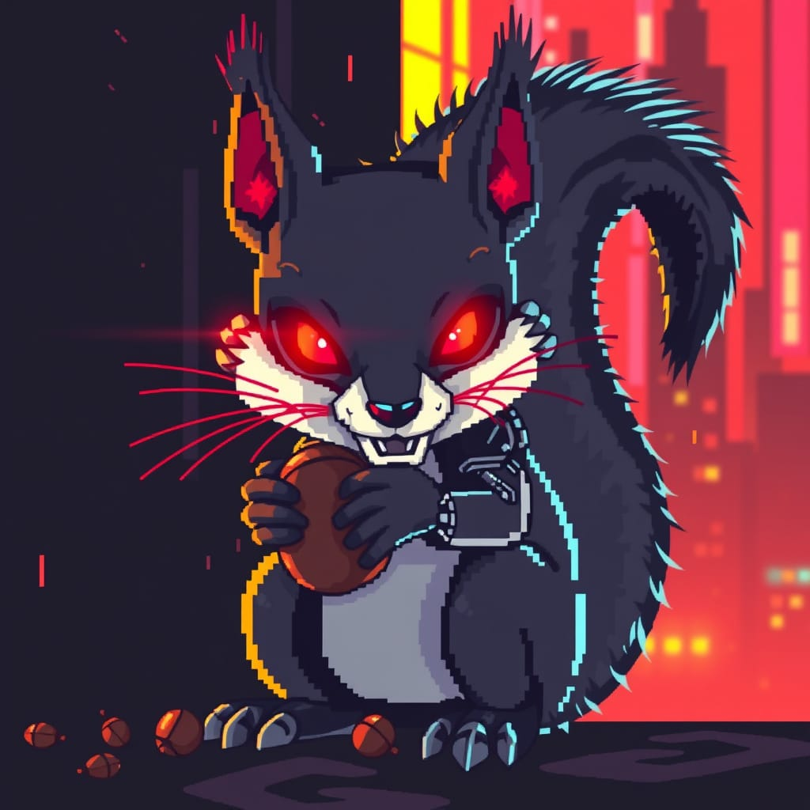

# FeralCTF — Technical Specification v1.0




> **Purpose of this document:** Complete implementation specification for the FeralCTF platform.
> Intended readers: human collaborators, AI coding agents (e.g. Qwen, OpenCode).
> This document is self-contained. Do not assume prior context. All decisions are documented here.

---

## 0. Project Summary

FeralCTF is a self-hosted Capture the Flag competition platform targeting non-profit and academic
competitions that run on minimal infrastructure. The entire platform ships as a **single
statically-linked binary** that embeds all frontend assets and requires no external runtime
dependencies (no Docker, no Node.js, no Python, no database server).

**Primary constraints:**
- Binary size: < 15 MB
- RAM at idle: < 50 MB
- RAM under load (200 concurrent users): < 200 MB
- CPU: runs on 1–2 vCPU comfortably
- Storage: < 10 MB database for a 500-team / 50-challenge competition

**Feature target:** Full parity with CTFd and Mellivora for small-to-medium competitions.

---

## 1. Technology Stack

### 1.1 Language & Runtime

- **Language:** Rust (stable toolchain, minimum 1.75)
- **Async runtime:** Tokio (multi-threaded, work-stealing)
- **Web framework:** Axum 0.7.x

No other runtime is required. The binary is fully self-contained.

### 1.2 Database

- **Engine:** SQLite via `sqlx` 0.7.x
- **Mode:** WAL (Write-Ahead Logging) + `synchronous=NORMAL`
- **Connection pool:** 1 write connection + 8 read connections
- **Rationale:** CTF workloads are ~95% reads. WAL allows unlimited concurrent readers with a
  single non-blocking writer. SQLite is adequate; no Postgres/MySQL needed.
- **Backup:** `sqlite3 ctf.db ".backup ctf-backup.db"` — hot backup, zero downtime
- **Alternative backend:** JSON flat-file driver toggled via `FERALCTF_BACKEND=json` for
  ephemeral workshop/demo deployments where persistence is not required.

### 1.3 Key Crates

| Crate | Version | Purpose |
|---|---|---|
| axum | 0.7.x | HTTP router, handlers, middleware |
| tokio | 1.x | Async runtime |
| sqlx | 0.7.x | SQLite async queries (compile-time verified) |
| rusqlite | 0.31.x | SQLite backup, VACUUM, admin ops |
| rust-embed | 8.x | Embed frontend assets into binary at build time |
| argon2 | 0.5.x | Password hashing (Argon2id) |
| jsonwebtoken | 9.x | JWT auth (HS256) |
| serde / serde_json | 1.x | JSON serialization, import/export |
| tower-http | 0.5.x | CORS, compression, rate limiting middleware |
| tracing | 0.1.x | Structured JSON logging |
| zip | 0.6.x | Challenge file attachment packaging |
| dashmap | 5.x | In-process concurrent cache (scoreboard, sessions) |

### 1.4 Frontend

- **Stack:** Vanilla JavaScript SPA + custom CSS. No React, Vue, or build pipeline.
- **Delivery:** Embedded into the binary via `rust-embed` at compile time.
- **Bundle size:** < 200 KB uncompressed, < 60 KB gzipped
- **Real-time:** WebSocket for live scoreboard → fallback SSE → fallback 30s polling
- **Theme:** Dark terminal aesthetic (monospace throughout), light mode toggle available
- **Responsive:** Yes — mobile-friendly for on-site competitions

---

## 2. Architecture

### 2.1 Process Model

FeralCTF runs as a **single OS process**. All subsystems run inside one Tokio runtime:

```
feralctf [--config config.toml] [--port 8080] [--db ./ctf.db]
```

On startup the binary:
1. Runs database migrations (idempotent)
2. Loads `config.toml` (or environment variable overrides)
3. Starts Axum HTTP server on configured port
4. Starts background workers:
   - Scoreboard cache refresh
   - Submission rate limiter GC (every 60s)
   - WebSocket broadcast hub
   - WAL checkpoint scheduler

### 2.2 Caching

All hot-path reads are served from in-process memory. The database is only hit on writes and
cache misses.

| Cache | Type | Invalidation |
|---|---|---|
| Scoreboard | `Arc<RwLock<ScoreboardState>>` | On every accepted flag submission |
| Challenge list | `Arc<RwLock<Vec<Challenge>>>` | On admin challenge create/update/delete |
| User sessions | `DashMap<TokenHash, Session>` | TTL-based, 15 min, with JWT refresh |
| Rate limit counters | `DashMap<IpAddr, RateBucket>` | GC every 60s |

### 2.3 Request Latency Targets

| Layer | Component | Target |
|---|---|---|
| TLS | Reverse proxy (nginx/Caddy) — not built-in | < 1 ms |
| Rate limiting | Tower middleware, per-IP sliding window | < 0.1 ms |
| Auth | JWT validation, cache lookup | < 0.5 ms |
| Handler | Business logic | < 1 ms (cached) |
| Cache | DashMap read | < 0.1 ms |
| Database | sqlx SQLite pool | < 5 ms |

### 2.4 WebSocket Architecture

A single `tokio::sync::broadcast` channel serves all connected WebSocket clients.

**Event types:**
```rust
enum WsEvent {
    NewSolve    { team: String, challenge: String, points: u32, first_blood: bool },
    Announcement { title: String, body: String },
    StateChange  { started: bool, ended: bool, frozen: bool },
    ScoreUpdate  { scoreboard: Vec<TeamScore> },
}
```

- Max tested: 500 concurrent WS connections on 1 vCPU
- Fallback chain: WebSocket → Server-Sent Events → 30s polling

---

## 3. Database Schema

All tables use `INTEGER PRIMARY KEY` (SQLite rowid alias).
Foreign key enforcement is at the application layer (not SQLite FK pragma) to avoid per-connection
overhead.

### 3.1 Table Definitions

```sql
CREATE TABLE users (
    id           INTEGER PRIMARY KEY,
    username     TEXT NOT NULL UNIQUE,
    email        TEXT UNIQUE,
    password_hash TEXT NOT NULL,           -- Argon2id
    role         TEXT NOT NULL DEFAULT 'player', -- admin | player | spectator
    team_id      INTEGER REFERENCES teams(id),
    created_at   INTEGER NOT NULL          -- Unix timestamp
);

CREATE TABLE teams (
    id           INTEGER PRIMARY KEY,
    name         TEXT NOT NULL UNIQUE,
    invite_code  TEXT NOT NULL UNIQUE,
    score        INTEGER NOT NULL DEFAULT 0,
    last_solve_at INTEGER                  -- Unix timestamp, for tiebreaking
);

CREATE TABLE challenges (
    id           INTEGER PRIMARY KEY,
    slug         TEXT NOT NULL UNIQUE,     -- stable identifier for import/export
    title        TEXT NOT NULL,
    description  TEXT NOT NULL,            -- Markdown, sanitized on render
    category     TEXT NOT NULL,
    flag_hash    TEXT NOT NULL,            -- sha256(lowercase(trim(flag)) + flag_salt)
    flag_salt    TEXT NOT NULL,
    flag_type    TEXT NOT NULL DEFAULT 'static', -- static | regex | dynamic
    flag_case_sensitive INTEGER NOT NULL DEFAULT 0,
    points       INTEGER NOT NULL,
    max_points   INTEGER NOT NULL DEFAULT 500,
    min_points   INTEGER NOT NULL DEFAULT 50,
    decay_rate   INTEGER NOT NULL DEFAULT 12,
    author       TEXT,
    tags         TEXT,                     -- JSON array string
    unlock_requires INTEGER REFERENCES challenges(id),
    is_hidden    INTEGER NOT NULL DEFAULT 1, -- 0=visible, 1=hidden/draft, 2=archived
    created_at   INTEGER NOT NULL
);

CREATE TABLE solves (
    id           INTEGER PRIMARY KEY,
    team_id      INTEGER NOT NULL REFERENCES teams(id),
    user_id      INTEGER NOT NULL REFERENCES users(id),
    challenge_id INTEGER NOT NULL REFERENCES challenges(id),
    solved_at    INTEGER NOT NULL,
    UNIQUE(team_id, challenge_id)
);

CREATE TABLE submissions (
    id           INTEGER PRIMARY KEY,
    team_id      INTEGER NOT NULL,
    user_id      INTEGER NOT NULL,
    challenge_id INTEGER NOT NULL,
    flag         TEXT NOT NULL,            -- raw submitted value, for audit
    is_correct   INTEGER NOT NULL,
    ip_address   TEXT,
    submitted_at INTEGER NOT NULL
);

CREATE TABLE hints (
    id           INTEGER PRIMARY KEY,
    challenge_id INTEGER NOT NULL REFERENCES challenges(id),
    content      TEXT NOT NULL,
    cost_points  INTEGER NOT NULL DEFAULT 0,
    sort_order   INTEGER NOT NULL DEFAULT 0
);

CREATE TABLE hint_unlocks (
    id              INTEGER PRIMARY KEY,
    team_id         INTEGER NOT NULL,
    hint_id         INTEGER NOT NULL,
    points_deducted INTEGER NOT NULL,
    unlocked_at     INTEGER NOT NULL,
    UNIQUE(team_id, hint_id)
);

CREATE TABLE files (
    id           INTEGER PRIMARY KEY,
    challenge_id INTEGER NOT NULL REFERENCES challenges(id),
    filename     TEXT NOT NULL,
    storage_path TEXT NOT NULL,            -- path on disk, outside webroot
    size_bytes   INTEGER NOT NULL,
    sha256       TEXT NOT NULL
);

CREATE TABLE announcements (
    id           INTEGER PRIMARY KEY,
    title        TEXT NOT NULL,
    body         TEXT NOT NULL,
    challenge_id INTEGER REFERENCES challenges(id),
    is_visible   INTEGER NOT NULL DEFAULT 1,
    created_at   INTEGER NOT NULL
);

CREATE TABLE score_history (
    id           INTEGER PRIMARY KEY,
    team_id      INTEGER NOT NULL,
    score        INTEGER NOT NULL,
    recorded_at  INTEGER NOT NULL          -- sampled every 5 min for graph
);

CREATE TABLE sessions (
    id           INTEGER PRIMARY KEY,
    user_id      INTEGER NOT NULL,
    token_hash   TEXT NOT NULL UNIQUE,     -- sha256 of JWT
    expires_at   INTEGER NOT NULL,
    revoked      INTEGER NOT NULL DEFAULT 0
);

CREATE INDEX idx_solves_team    ON solves(team_id);
CREATE INDEX idx_solves_chal    ON solves(challenge_id);
CREATE INDEX idx_submissions_team ON submissions(team_id, challenge_id);
CREATE INDEX idx_score_history  ON score_history(team_id, recorded_at);
CREATE INDEX idx_sessions_token ON sessions(token_hash);
```

### 3.2 Dynamic Scoring Formula

```
points = max(min_points, ceil(max_points - decay_rate * (solves - 1)²))
```

Default parameters: `max_points=500`, `min_points=50`, `decay_rate=12`

This produces:
- 1st solve: 500 pts
- 2nd solve: 488 pts
- 3rd solve: 452 pts
- 6th solve: ~50 pts (clamped)

Static scoring (fixed `points` value, decay ignored) is the default for new challenges.

---

## 4. REST API

All endpoints return `application/json`. Authentication uses `Authorization: Bearer <JWT>`.
Rate limits are enforced per-IP via Tower middleware.

### 4.1 Auth

| Method | Path | Auth | Description |
|---|---|---|---|
| POST | `/api/auth/register` | None | Register user; first user becomes admin |
| POST | `/api/auth/login` | None | Returns signed JWT |
| POST | `/api/auth/logout` | Required | Revokes token in `sessions` table |
| GET | `/api/auth/me` | Required | Current user + team info |
| PUT | `/api/auth/password` | Required | Change password |

**Login response:**
```json
{
  "token": "<JWT>",
  "expires_at": 1762300800,
  "user": { "id": 1, "username": "n0tf0und", "role": "admin", "team_id": 3 }
}
```

### 4.2 Challenges

| Method | Path | Auth | Description |
|---|---|---|---|
| GET | `/api/challenges` | Required | List visible challenges + per-team solve status |
| GET | `/api/challenges/:id` | Required | Challenge detail, hints (unlocked content), files |
| POST | `/api/challenges/:id/submit` | Required | Submit flag; rate limited 10/min/team |
| POST | `/api/challenges/:id/hints/:hid/unlock` | Required | Unlock hint, deduct points |
| POST | `/api/admin/challenges` | Admin | Create challenge |
| PUT | `/api/admin/challenges/:id` | Admin | Update challenge (live during competition) |
| DELETE | `/api/admin/challenges/:id` | Admin | Delete challenge |

**Challenge list item:**
```json
{
  "id": 1,
  "slug": "jwt-jockey",
  "title": "JWT Jockey",
  "category": "web",
  "points": 100,
  "solve_count": 42,
  "solved_by_team": true,
  "is_hidden": false,
  "tags": ["jwt", "auth"],
  "file_count": 1,
  "hint_count": 2,
  "unlock_requires": null
}
```

**Flag submission:**
```json
// Request
{ "flag": "flag{alg_none_ftw}" }

// Response (correct)
{ "correct": true, "points_earned": 100, "first_blood": false, "new_score": 2850 }

// Response (wrong)
{ "correct": false, "message": "Incorrect flag." }

// Response (rate limited)
{ "error": "rate_limited", "retry_after_seconds": 45 }
```

### 4.3 Scoreboard & Teams

| Method | Path | Auth | Description |
|---|---|---|---|
| GET | `/api/scoreboard` | Optional | Full scoreboard (served from cache) |
| GET | `/api/scoreboard/graph` | Optional | Score-over-time for all teams (5 min samples) |
| GET | `/api/teams/:id` | Optional | Team profile + solve history |
| POST | `/api/teams` | Required | Create team |
| POST | `/api/teams/join` | Required | Join team by invite code |
| GET | `/api/admin/teams` | Admin | All teams with full stats |
| POST | `/api/admin/teams/:id/disqualify` | Admin | Zero score, hide from scoreboard |

### 4.4 Import / Export

| Method | Path | Auth | Description |
|---|---|---|---|
| GET | `/api/admin/export` | Admin | Export full competition to JSON |
| GET | `/api/admin/export?attachments=zip` | Admin | JSON + companion attachments.zip |
| POST | `/api/admin/import` | Admin | Import from JSON (multipart/form-data) |
| POST | `/api/admin/import?dry_run=true` | Admin | Validate without writing |

### 4.5 Admin Operations

| Method | Path | Auth | Description |
|---|---|---|---|
| GET | `/api/admin/submissions` | Admin | Full submission log (paginated, filterable) |
| POST | `/api/admin/announce` | Admin | Broadcast announcement |
| GET | `/api/admin/backup` | Admin | Download raw SQLite database file |
| POST | `/api/admin/competition/start` | Admin | Start competition |
| POST | `/api/admin/competition/end` | Admin | End competition |
| POST | `/api/admin/competition/freeze` | Admin | Freeze scoreboard |
| GET | `/api/admin/stats` | Admin | RAM, CPU, active connections |

---

## 5. Import / Export Format

### 5.1 Export

`GET /api/admin/export` returns a JSON file download.
`GET /api/admin/export?attachments=inline` base64-encodes files < 5 MB inline.
`GET /api/admin/export?attachments=zip` returns JSON only; attachments in separate ZIP.

**Export schema:**
```json
{
  "feralctf_export_version": 1,
  "exported_at": "2026-11-08T18:00:00Z",
  "competition": {
    "name": "FeralCTF 2026",
    "dynamic_scoring": true,
    "score_freeze_minutes_before_end": 30,
    "max_team_size": 4
  },
  "categories": ["web", "crypto", "pwn", "forensics", "rev", "misc"],
  "challenges": [
    {
      "slug": "jwt-jockey",
      "title": "JWT Jockey",
      "category": "web",
      "description": "The admin forgot to validate the algorithm field.",
      "flag": "flag{alg_none_ftw}",
      "flag_type": "static",
      "flag_case_sensitive": false,
      "points": 100,
      "max_points": 500,
      "min_points": 50,
      "decay_rate": 12,
      "author": "n0tf0und",
      "tags": ["jwt", "auth"],
      "hints": [
        { "order": 1, "cost": 25, "content": "Think algorithm confusion attacks." },
        { "order": 2, "cost": 50, "content": "Try alg: none." }
      ],
      "files": [
        {
          "filename": "jwt_jockey.zip",
          "sha256": "a3f9c1...",
          "size_bytes": 14823,
          "data": "<base64>"
        }
      ],
      "unlock_requires": null,
      "is_hidden": false
    }
  ]
}
```

> **Security note:** Flags are exported in plaintext. This endpoint is admin-only.
> Treat pre-competition exports as sensitive material.

**What is included / excluded:**

| Field | Included | Notes |
|---|---|---|
| Competition metadata | Yes | Name, timing config, scoring config |
| All challenges | Yes | Including hidden/draft |
| Plaintext flags | Yes | Admin only — sensitive |
| Hints + costs | Yes | Full content and point costs |
| File attachments | Optional | Inline base64 or separate ZIP |
| Challenge tags | Yes | |
| Unlock dependencies | Yes | |
| Solve counts / submissions | **No** | Competition data stays in DB |
| User accounts / team scores | **No** | Export is challenge content only |

### 5.2 Import

`POST /api/admin/import` accepts `multipart/form-data`:

| Field | Type | Required | Description |
|---|---|---|---|
| `file` | JSON file | Yes | FeralCTF or CTFd export |
| `attachments` | ZIP file | No | Challenge attachment files |
| `overwrite` | bool | No (default: false) | Overwrite existing slugs |
| `dry_run` | bool | No (default: false) | Validate only, no DB writes |

**Dry run response:**
```json
{
  "valid": true,
  "challenges_to_create": 14,
  "challenges_to_skip": 0,
  "challenges_to_overwrite": 0,
  "attachment_warnings": [],
  "validation_errors": [],
  "preview": [
    { "slug": "jwt-jockey", "action": "create" },
    { "slug": "baby-rsa",   "action": "create" }
  ]
}
```

**Conflict resolution:**

| Scenario | Default (overwrite=false) | overwrite=true |
|---|---|---|
| Slug not in DB | Create | Create |
| Slug exists, identical | Skip (no-op) | Skip (no-op) |
| Slug exists, differs | Skip + warn | Overwrite |
| Attachment missing from ZIP | Import challenge, warn | Same |
| Invalid JSON | Reject entire import, no partial writes | Same |
| Unknown JSON field | Ignored (forward compat) | Same |
| CTFd format detected | Auto-convert via compat layer | Same |

### 5.3 CTFd Compatibility

When a CTFd export ZIP is uploaded, the format is detected automatically.

| CTFd Field | FeralCTF Field | Notes |
|---|---|---|
| `name` | `title` | Direct map |
| `category` | `category` | Direct map |
| `description` | `description` | HTML stripped to Markdown |
| `value` | `points` + `max_points` | Same value used for both |
| `type: standard` | `flag_type: static` | |
| `type: regex` | `flag_type: regex` | |
| `type: dynamic` | `flag_type: dynamic` | **Warning flag set** — review decay params |
| `flags[].content` | `flag` | First flag used; alternates stored |
| `hints` | `hints` | Cost + content mapped directly |
| `files` | `files` | Extracted from CTFd ZIP structure |
| `tags` | `tags` | Direct map |

> CTFd dynamic challenges get a warning flag on import because CTFd's decay formula differs
> from FeralCTF's. These challenges are imported as hidden and require admin review.

### 5.4 CLI Import

```bash
feralctf import challenges.json
feralctf import challenges.json --attachments ./files/ --overwrite
feralctf import challenges.json --dry-run
```

Recommended workflow: `--dry-run` first, review output, then import.

---

## 6. Security

### 6.1 Flag Storage

Flags are never stored in plaintext.

```
flag_hash = sha256(lowercase(trim(flag)) + challenge.flag_salt)
```

Each challenge has a unique random salt. Submission comparison hashes the user input and
compares. A database dump cannot recover flags.

### 6.2 Password Storage

Argon2id with parameters: `memory=65536` (64 MB), `iterations=3`, `parallelism=2`.
Target: ~300 ms per hash on the deployment target. Tune `memory` up/down to hit this target.

### 6.3 Authentication

- JWT HS256 signed with a server-generated secret (stored in config, not DB)
- Server-side revocation via `sessions` table (token_hash column)
- Default TTL: 24 hours for players, 4 hours for admin tokens
- Admin tokens require re-authentication for destructive operations (delete, disqualify, backup)
- All admin actions logged: `user_id`, `action`, `target`, `timestamp`, `ip`

### 6.4 Input Validation

- All SQL via `sqlx` parameterized queries — SQL injection not possible
- File uploads: extension allowlist, magic byte validation, 100 MB size limit, stored outside webroot
- Flag submissions: max 256 chars, stripped of leading/trailing whitespace
- Challenge descriptions: Markdown input, HTML-sanitized on client render (no stored XSS)
- All API inputs validated via `serde` + custom validators before handler logic

### 6.5 Anti-Cheat

- Submission rate limit: 10 attempts/minute per team (configurable)
- Exponential backoff after 5 wrong attempts per challenge per team
- Flag sharing detection: same correct flag submitted by 2+ teams within configurable window → alert
- All submissions log IP address for forensic analysis
- Flag rotation: admin can update a challenge flag mid-competition; old hash invalidated immediately

### 6.6 HTTP Security Headers

Set by Tower middleware on all responses:
```
X-Content-Type-Options: nosniff
X-Frame-Options: DENY
Referrer-Policy: strict-origin-when-cross-origin
Content-Security-Policy: default-src 'self'
```

---

## 7. Configuration

Full `config.toml` reference:

```toml
[server]
port = 8080
host = "0.0.0.0"
base_url = "https://ctf.yourdomain.com"

[competition]
name = "FeralCTF 2026"
start_time = "2026-11-07T09:00:00-06:00"   # ISO 8601 with timezone
end_time   = "2026-11-08T17:00:00-06:00"
team_mode = true                             # false = individual scoring
max_team_size = 4
registration_open = true
dynamic_scoring = true
score_freeze_minutes_before_end = 30         # 0 = no freeze

[database]
path = "./ctf.db"
backend = "sqlite"                           # or "json" for ephemeral

[auth]
jwt_secret = ""                              # auto-generated on first run if empty
session_ttl_hours = 24
admin_session_ttl_hours = 4

[storage]
attachments_path = "./attachments"           # must be outside webroot
max_file_size_mb = 100

[rate_limit]
submissions_per_minute = 10
wrong_attempts_before_backoff = 5
backoff_base_seconds = 30

[notifications]
discord_webhook_url = ""                     # optional, for first blood + announcements

[logging]
level = "info"                               # trace | debug | info | warn | error
format = "json"                              # json | pretty
```

All config values can be overridden with environment variables using the prefix `FERALCTF_`:

```bash
FERALCTF_SERVER_PORT=9090
FERALCTF_DATABASE_PATH=/data/ctf.db
FERALCTF_AUTH_JWT_SECRET=supersecret
```

---

## 8. Deployment

### 8.1 Minimum Viable Deployment

```bash
# Download
curl -L https://github.com/yourorg/feralctf/releases/latest/download/feralctf-linux-x86_64 \
  -o feralctf && chmod +x feralctf

# Initialize (generates config.toml + empty DB)
./feralctf init

# Edit config.toml, then run
./feralctf --port 8080

# First user to register becomes admin
```

### 8.2 Reverse Proxy (nginx)

TLS is handled by the reverse proxy. FeralCTF handles WebSocket upgrade internally.

```nginx
server {
    listen 443 ssl;
    server_name ctf.yourdomain.com;

    location / {
        proxy_pass http://127.0.0.1:8080;
        proxy_http_version 1.1;
        proxy_set_header Upgrade $http_upgrade;
        proxy_set_header Connection "upgrade";
        proxy_set_header Host $host;
        proxy_set_header X-Real-IP $remote_addr;
    }
}
```

### 8.3 Systemd Service

```ini
[Unit]
Description=FeralCTF Platform
After=network.target

[Service]
Type=simple
User=ctf
WorkingDirectory=/opt/feralctf
ExecStart=/opt/feralctf/feralctf
Restart=on-failure
MemoryMax=768M
CPUQuota=150%

[Install]
WantedBy=multi-user.target
```

### 8.4 Backup

```bash
# Hot backup (no downtime required)
sqlite3 ctf.db ".backup ctf-backup-$(date +%Y%m%d-%H%M).db"

# Or via API
curl -H "Authorization: Bearer $ADMIN_TOKEN" \
  https://ctf.yourdomain.com/api/admin/backup > backup.db
```

---

## 9. Build

### 9.1 Prerequisites

- Rust stable 1.75+
- `cargo` (bundled with Rust)
- Optional: `cargo-watch` for dev hot-reload
- Optional: `sqlx-cli` for migration management

### 9.2 Commands

```bash
cargo run                                               # dev build + run
cargo build --release                                   # optimized release (~10 MB)
cargo build --release --target x86_64-unknown-linux-musl  # fully static musl binary
cargo run -- migrate                                    # run DB migrations
cargo run -- import challenges.json --dry-run           # validate import bundle
cargo test                                              # run test suite
cargo test --test integration                           # integration tests only
```

### 9.3 Project Structure

```
feralctf/
  src/
    main.rs                 # startup, config loading, signal handling
    config.rs               # Config struct, env var overrides, validation
    db/
      mod.rs                # connection pool setup, migration runner
      schema.sql            # canonical schema (source of truth)
      migrations/           # versioned .sql migration files
    handlers/
      auth.rs               # register, login, logout, me, password
      challenges.rs         # list, detail, submit, hint unlock
      scoreboard.rs         # scoreboard (cache-served), graph data
      admin.rs              # challenge CRUD, user/team mgmt, competition controls
      ws.rs                 # WebSocket hub, event broadcast
    models/
      user.rs               # User, Role
      team.rs               # Team
      challenge.rs          # Challenge, Hint, File, Submission, Solve
      scoreboard.rs         # TeamScore, ScoreboardState
    cache.rs                # in-process cache types and invalidation logic
    scoring.rs              # dynamic scoring formula, score recalculation
    anticheat.rs            # rate limiting, flag sharing detection, backoff
    storage.rs              # file attachment upload, validation, serving
    import_export.rs        # JSON export, JSON import, CTFd compat adapter
    auth.rs                 # JWT signing/verification, Argon2id hashing
    errors.rs               # unified error types, HTTP error responses
  frontend/
    index.html              # SPA shell
    app.js                  # all UI logic (challenges, scoreboard, admin, profile)
    style.css               # dark terminal theme
  migrations/
    001_initial.sql
    002_score_history.sql
  Cargo.toml
  config.example.toml
  README.md
```

---

## 10. Feature Checklist

Use this as a task tracker for implementation.

### Core
- [ ] SQLite schema + migrations
- [ ] Config loading (file + env var override)
- [ ] Argon2id password hashing
- [ ] JWT auth (sign, verify, revoke)
- [ ] User registration + login
- [ ] Team creation + invite-code join
- [ ] Challenge CRUD (admin)
- [ ] Challenge list endpoint (with solve status per team)
- [ ] Flag submission (static)
- [ ] Flag submission (regex)
- [ ] Dynamic scoring formula
- [ ] Hint unlock (deduct points)
- [ ] File attachment upload + serve
- [ ] Scoreboard (cached, sorted, tiebreak by last_solve_at)
- [ ] Score history sampling (5 min interval background task)
- [ ] WebSocket hub + event broadcast
- [ ] Rate limiting middleware (per-IP)
- [ ] Submission backoff (per-team per-challenge)
- [ ] Frontend SPA (challenges, scoreboard, profile, admin)
- [ ] rust-embed frontend bundle

### Import / Export
- [ ] JSON export endpoint (challenges + metadata)
- [ ] JSON export with inline base64 attachments
- [ ] JSON export with companion ZIP
- [ ] JSON import endpoint (dry-run mode)
- [ ] JSON import conflict resolution (skip / overwrite)
- [ ] CTFd export format detection + adapter
- [ ] CLI import subcommand (`feralctf import`)

### Admin
- [ ] Competition start / end / freeze controls
- [ ] Announcement broadcast (WebSocket + stored)
- [ ] Submission log (paginated, filterable by team/challenge/result)
- [ ] User ban
- [ ] Team disqualify (zero score, hide)
- [ ] Challenge flag rotation (invalidate old hash)
- [ ] Score rollback (reject a solve, recalculate)
- [ ] Database backup download endpoint
- [ ] Resource stats endpoint (RAM, CPU, connections)

### Security
- [ ] HTTP security headers (Tower middleware)
- [ ] Flag storage as salted hash (never plaintext in DB)
- [ ] Admin action audit log
- [ ] IP logging on all submissions
- [ ] Flag sharing detection alert
- [ ] File upload validation (extension allowlist + magic bytes)

### Deployment
- [ ] `feralctf init` subcommand (generate config + empty DB)
- [ ] Systemd service file (in repo as `deploy/feralctf.service`)
- [ ] Docker image (optional, for users who prefer it)
- [ ] ARM64 cross-compilation target
- [ ] GitHub Actions CI (build + test on push)
- [ ] Release workflow (build static musl binary, attach to GitHub release)

---

## 11. Out of Scope (v1)

The following are explicitly deferred to keep v1 scope manageable:

- Per-challenge Docker spawner (netcat/pwn services) — separate optional module
- TOTP / 2FA — roadmap item
- Multi-instance replication (litestream / LiteFS) — roadmap item
- CTFtime.org API integration — roadmap item
- Writeup submission system — post-competition feature
- OAuth login (Discord, GitHub) — roadmap item

---

## 12. Glossary

| Term | Definition |
|---|---|
| **slug** | URL-safe string identifier for a challenge, stable across import/export (e.g. `jwt-jockey`) |
| **first blood** | First team to solve a given challenge; may award bonus points |
| **score freeze** | Scoreboard stops updating N minutes before competition end; submissions still accepted |
| **dynamic scoring** | Challenge point value decreases as more teams solve it |
| **WAL** | Write-Ahead Logging — SQLite journal mode enabling concurrent reads |
| **DQ** | Disqualified — team score zeroed and hidden from public scoreboard |
| **CTFd** | Popular open-source CTF platform; FeralCTF supports importing its export format |

---

*FeralCTF — built by defenders, for defenders.*
*Apache 2.0 License · CyberSquirrels CTF Team*
