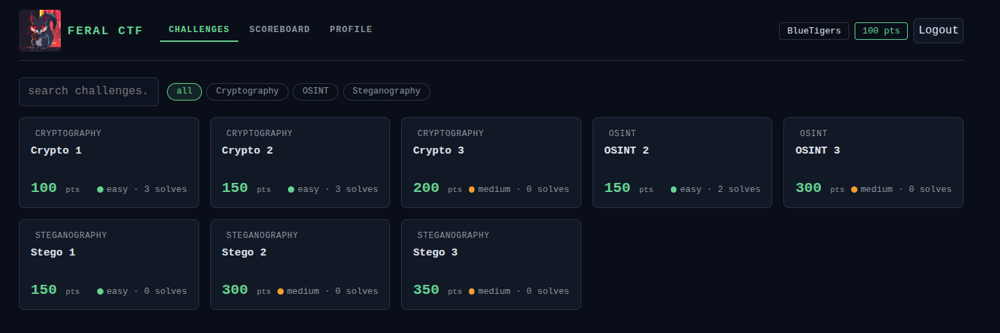

# FeralCTF

<p align="center">
  
</p>

FeralCTF is a lightweight, self-hosted Capture The Flag platform for academic, nonprofit,
workshop, and small-to-medium competitions. It runs as one Rust binary with SQLite storage
and embedded frontend assets. Production use does not require Node.js, Docker, an external
database server, or a separate frontend build pipeline.

For deep technical details, see [FERALCTF_SPEC.md](FERALCTF_SPEC.md).



## Status

Current release: **v1.0.0** — all core sprints complete. Feature-complete for small-to-medium competitions;
see [§11 Out of Scope](FERALCTF_SPEC.md) for deferred items.

## Features

- Web-based user registration, login, logout, password change, and server-side session revocation
- First registered user becomes the initial admin; admin navigation is hidden from non-admin accounts
- Team creation and invite-code joining
- Challenge list and detail views with files, hints, solve status, categories, search, and flag submission
- Static and regex flag validation with salted hashes for static flags
- Dynamic scoring, score recalculation, score history, and cached scoreboard reads
- Live scoreboard updates over WebSocket
- Admin challenge list (all challenges including hidden), visibility toggle, create, update, and delete
- Admin user, team, competition, announcement, import/export, and backup controls
- JSON/ZIP challenge import and export, including CTFd import detection
- Dry-run imports for previewing challenge bundles before writing to the database
- Submission rate limiting, wrong-attempt backoff, and flag-sharing alerts
- Admin audit log for sensitive management actions
- Themed error pages for unknown routes
- HTTP security headers and configurable CORS
- Recommended reverse-proxy TLS deployment, with optional built-in HTTPS mode
- Single-binary startup with embedded frontend and embedded schema migrations

## Quick Start

Actual production deployments should see the deployment section of the specification for HTTPS setup.
nginx or Caddy in front of FeralCTF is recommended for production TLS, certificate renewal,
redirects, caching, request limits, and hosting related files. Built-in TLS is available as a
simpler deployment option. [Deployment Notes](https://github.com/gnulinuxadmin/FeralCTF/blob/main/FERALCTF_SPEC.md#8-deployment)

This quick started is intended to allow you to try FeralCTF out locally or stage the challenges locally
to move to a server hosting FeralCTF when you publish the game.

Build or download the `feralctf` binary, then initialize a working directory:

```bash
./feralctf init
```

This creates:

```text
config.toml
ctf.db
attachments/
```

Start the server:

```bash
./feralctf --port 8080
```

Open `http://localhost:8080`, register the first account, and use that account as the initial admin.

## Commands

```bash
feralctf
feralctf --port 8080
feralctf --config /path/to/config.toml
feralctf init
feralctf migrate
feralctf import challenges.json
feralctf import challenges.json --dry-run
feralctf import challenges.json --overwrite
feralctf import challenges.json --attachments ./attachments
```

The default command starts the server. `init` creates a local install. `migrate` applies
embedded schema migrations. `import --dry-run` validates and previews a bundle without
writing challenge rows.

## Deployment

Recommended production layout:

```text
Internet
  |
  v
Caddy/nginx with HTTPS
  |
  v
feralctf on localhost:8080
  |
  v
config.toml + ctf.db + attachments/
```

Operational notes:

- Run one FeralCTF process per competition.
- Keep `config.toml`, `ctf.db`, backups, and exports private.
- Put production instances behind HTTPS; nginx or Caddy is recommended, with built-in TLS available as an option.
- Store attachments outside any public webroot.
- Back up the SQLite database before and after major event milestones.
- Existing static flags are stored as salted hashes and cannot be recovered as plaintext.
  FeralCTF-to-FeralCTF exports include verifier data so round-trips remain possible.

## Configuration

Configuration is loaded from defaults, optional TOML, and environment variables.

Common settings:

```toml
[server]
host = "0.0.0.0"
port = 8080
base_url = "https://ctf.example.org"
allowed_origins = []
tls_enabled = false
tls_cert_path = ""
tls_key_path = ""
tls_chain_path = ""

[database]
path = "./ctf.db"

[auth]
jwt_secret = "change-me"

[storage]
attachments_path = "./attachments"
```

Useful environment overrides:

```bash
FERALCTF_SERVER_PORT=9090
FERALCTF_SERVER_ALLOWED_ORIGINS=https://ctf.example.org
FERALCTF_SERVER_TLS_ENABLED=true
FERALCTF_SERVER_TLS_CERT_PATH=/etc/letsencrypt/live/ctf/fullchain.pem
FERALCTF_SERVER_TLS_KEY_PATH=/etc/letsencrypt/live/ctf/privkey.pem
FERALCTF_SERVER_TLS_CHAIN_PATH=/etc/letsencrypt/live/ctf/chain.pem
FERALCTF_DATABASE_PATH=/data/ctf.db
FERALCTF_AUTH_JWT_SECRET=change-me
FERALCTF_STORAGE_ATTACHMENTS_PATH=/data/attachments
```

## Security

- Passwords are hashed with Argon2id.
- Static flags are stored as salted hashes, not plaintext.
- Public challenge responses do not expose flag hashes or salts.
- JWTs are backed by server-side session revocation.
- HTTP security headers are applied to responses.
- Admin management actions are written to `audit_log`.
- Every flag submission is recorded.
- Submission rate limiting and wrong-attempt backoff are enforced per team.
- Flag-sharing detection is alert-only; it does not automatically disqualify teams.

## Development

Install a stable Rust toolchain, then run:

```bash
cargo fmt
cargo check
cargo test
cargo clippy --all-targets --all-features
```

Build a release binary:

```bash
cargo build --release
```

The default release binary dynamically links against the host `libc`/`libm`/`libgcc_s`,
which are present on all standard Linux distributions.

### Static binary (musl)

For minimal container images, airgapped environments, or deployments requiring a
self-contained binary with no shared-library dependencies:

```bash
rustup target add x86_64-unknown-linux-musl
cargo build --release --target x86_64-unknown-linux-musl
# binary: target/x86_64-unknown-linux-musl/release/feralctf
```

Run locally during development:

```bash
cargo run -- init
cargo run -- --port 8080
```

## Repository Layout

```text
src/
  auth.rs                 # password hashing, JWTs, sessions, flag hashes
  cache.rs                # scoreboard and challenge-list cache
  config.rs               # config structs, defaults, env overrides
  db/                     # SQLite pool and embedded migrations
  errors.rs               # application error type and JSON responses
  handlers/               # HTTP and WebSocket handlers
  import_export.rs        # challenge bundle export/import and CTFd adapter
  models/                 # database-backed domain models
  routes.rs               # Axum route wiring, security headers, SPA fallback
  scoring.rs              # dynamic scoring and score recalculation
  anticheat.rs            # anti-cheat and rate limiting
frontend/                 # embedded vanilla JS frontend
migrations/               # SQL migration sources embedded at compile time
FERALCTF_SPEC.md          # full technical specification
```

## License

Apache-2.0. See [LICENSE.md](LICENSE.md).
