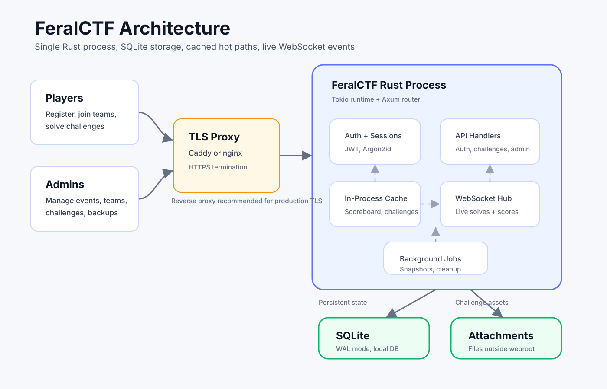

# FeralCTF

<p align="center">
  
</p>

FeralCTF is a lightweight, self-hosted Capture The Flag platform for academic, nonprofit, workshop, and small-to-medium competition environments. The goal is a simple deployment story: one Rust binary, SQLite storage, embedded frontend assets, and no required database server, Node.js runtime, Docker stack, or external services.

The project is designed for organizers who want the core CTFd-style experience without operating a heavier platform.

For the complete technical design, schema, API details, security model, and roadmap, see [FERALCTF_SPEC.md](FERALCTF_SPEC.md).

## Current Status

FeralCTF is under active development.

The core application is in place as a single-binary CTF platform with an embedded player and admin interface.

Status summary:

- Core backend foundations are implemented.
- Player authentication, teams, challenges, scoring, scoreboard, live event plumbing, and admin controls are in place.
- Challenge import/export is implemented, including dry-run import and CTFd detection.
- Submission rate limiting, exponential wrong-attempt backoff, and flag-sharing detection are implemented.
- The browser interface is served by the Rust binary without requiring a Node.js production runtime.
- CLI setup and migration commands, HTTP hardening, and admin audit logging are implemented.
- The codebase is regularly checked with `cargo check`, `cargo test`, and `cargo clippy --all-targets --all-features`.

Release builds are self-contained and remain comfortably below the intended size and idle memory targets.

## Architecture Overview

FeralCTF is built as a single-process Rust application.



At a high level:

- **Axum** handles HTTP routes and WebSocket upgrades.
- **Tokio** provides the async runtime.
- **SQLite** stores users, teams, challenges, submissions, solves, sessions, hints, files, announcements, and score history.
- **rusqlite + r2d2_sqlite** provide database access and pooling.
- **In-process cache** serves hot scoreboard and challenge-list reads.
- **JWT + server-side sessions** handle authentication and revocation.
- **Argon2id** protects passwords.
- **Salted SHA-256 flag hashes** protect static challenge flags.
- **WebSocket broadcast channel** publishes live public events such as solves and scoreboard updates.
- **In-process anti-cheat state** enforces submission rate limits and wrong-attempt backoff.
- **Vanilla JavaScript/CSS frontend** is embedded into the binary with `rust-embed`.

The intended runtime model is:

```text
browser / API client
        |
        v
Axum router + middleware
        |
        +--> auth/session verification
        +--> challenge and scoreboard handlers
        +--> admin handlers
        +--> WebSocket hub
        |
        v
in-process cache
        |
        v
SQLite database
```

SQLite runs in WAL mode for concurrent reads and simple backup/deployment operations.

## Completed Features

The following pieces are implemented:

- Project structure and Rust module layout
- SQLite schema and idempotent migration runner
- SQLite connection pool
- Configuration loading with defaults, TOML support, environment overrides, JWT secret generation, and attachment directory creation
- Unified JSON error responses
- Argon2id password hashing and verification
- JWT signing and verification
- Server-side session creation, revocation, validation, and cleanup
- Static flag hashing and verification
- Schema-aligned models for users, teams, challenges, hints, files, submissions, and scoreboard entries
- User registration and login
- First-user-becomes-admin behavior
- Logout and `/me`
- Password change
- Team creation and invite-code join
- Challenge listing and challenge detail APIs
- Locked hint behavior, where locked hint content is hidden
- Hint unlocks with point deduction
- Static flag submission
- Regex flag submission
- Submission logging for correct and incorrect attempts
- Solve recording
- Dynamic scoring formula and score recalculation
- Score history insertion
- Cached scoreboard endpoint
- Cached challenge list
- Scoreboard graph endpoint
- Team profile endpoint with solve history
- WebSocket hub
- Public `/ws` event stream
- WebSocket event serialization
- New solve and score update event support
- Admin-only challenge CRUD
- Admin user and team management
- Competition control and announcement endpoints
- SQLite backup endpoint
- Challenge bundle export (JSON, JSON with inline base64 attachments, or ZIP with attachment files)
- Challenge bundle import with dry-run and overwrite modes, including attachment ZIP upload
- CTFd JSON/ZIP import detection and conversion
- CLI challenge import command
- HTTP server startup via `cargo run`
- Submission rate limiting with HTTP 429 and `Retry-After`
- Exponential backoff for repeated wrong flag submissions
- Flag-sharing detection with indexed submission lookup and warning-only alerts
- Embedded vanilla JavaScript SPA served by the Rust binary
- Challenges view with category filter, search, challenge modal, hints, files, and flag submission
- Live scoreboard view that updates from WebSocket `score_update` events
- Profile view with team score/rank and solve history
- Admin SPA surfaces for overview, challenges, users, teams, and settings
- JWT session storage in the browser via `sessionStorage`
- Setup and migration commands for local installs
- HTTP security headers and configurable CORS
- Admin audit log for sensitive management actions
- Embedded schema migrations for single-binary operation

## How The Finished Application Will Work

When complete, FeralCTF is intended to run as a single service controlled by the event organizer.

Typical organizer flow:

1. Initialize a competition database and configuration.
2. Start the `feralctf` binary on a server or VM.
3. Put it behind a TLS reverse proxy such as Caddy or nginx.
4. Register the first account, which becomes the initial admin.
5. Create or import challenges, hints, files, and scoring settings.
6. Open registration for players or teams.
7. Monitor submissions, scoreboard movement, announcements, and competition state from the admin interface.
8. Review anti-cheat warning signals such as possible flag sharing.

Typical player flow:

1. Register or log in.
2. Create a team or join one using an invite code.
3. Browse visible challenges.
4. Download challenge files when provided.
5. Unlock hints when needed.
6. Submit flags.
7. Watch team score and live scoreboard updates.

Typical admin flow:

- Create, edit, hide, archive, or delete challenges.
- Store flags securely without plaintext database exposure.
- Review submissions and solve history.
- Manage users and teams.
- Start, end, or freeze a competition.
- Send announcements.
- Export/import challenge bundles.
- Download backups.
- Review audit and anti-cheat signals.

## Requirements When Complete

The finished application is intended to require:

- A Linux, macOS, or Windows host capable of running the compiled Rust binary.
- No external database server; SQLite is used locally.
- No Node.js runtime for production use.
- No Docker requirement, though container packaging may be added later for convenience.
- A writable working directory for:
  - SQLite database file
  - attachments
  - configuration
  - backups or exports
- A reverse proxy for production TLS termination.

Recommended production setup:

```text
Internet
  |
  v
Caddy/nginx with TLS
  |
  v
feralctf on localhost:8080
  |
  v
SQLite database + attachments directory
```

Operational expectations:

- Run one FeralCTF process per competition.
- Back up the SQLite database before and after major event milestones.
- Keep `config.toml` and exports containing plaintext flags private.
- Existing static flags are stored as salted hashes and cannot be recovered as plaintext; FeralCTF exports include verifier data so FeralCTF-to-FeralCTF round-trips remain lossless.
- Rate-limited clients receive HTTP 429 with a `Retry-After` header.
- Use a strong `auth.jwt_secret`.
- Store attachments outside any public webroot.
- Put production instances behind HTTPS.

## Upcoming Features

## API Surface Implemented So Far

Auth:

```text
POST /api/auth/register
POST /api/auth/login
POST /api/auth/logout
GET  /api/auth/me
PUT  /api/auth/password
```

Challenges:

```text
GET  /api/challenges
GET  /api/challenges/{id}
POST /api/challenges/{id}/submit
POST /api/challenges/{challenge_id}/hints/{hint_id}/unlock
```

Scoreboard and teams:

```text
GET  /api/scoreboard
GET  /api/scoreboard/graph
GET  /api/teams/{id}
POST /api/teams
POST /api/teams/join
```

WebSocket:

```text
GET /ws
```

Admin:

```text
GET  /api/admin
POST /api/admin/challenges
PUT  /api/admin/challenges/{id}
DELETE /api/admin/challenges/{id}
GET  /api/admin/submissions
GET  /api/admin/users
POST /api/admin/users/{id}/ban
GET  /api/admin/teams
POST /api/admin/teams/{id}/disqualify
POST /api/admin/competition/start
POST /api/admin/competition/end
POST /api/admin/competition/freeze
POST /api/admin/announce
GET  /api/admin/export
POST /api/admin/import
GET  /api/admin/backup
```

## Development

Install a stable Rust toolchain, then run:

```bash
cargo check
cargo test
cargo clippy --all-targets --all-features
```

Format before handing off changes:

```bash
cargo fmt
```

Run the current binary:

```bash
cargo run
```

## Configuration

Configuration is loaded from defaults, optional TOML, and environment variables.

Example environment overrides:

```bash
FERALCTF_SERVER_PORT=9090
FERALCTF_DATABASE_PATH=/data/ctf.db
FERALCTF_AUTH_JWT_SECRET=change-me
```

Environment variables use the `FERALCTF_` prefix.

## Repository Layout

```text
src/
  auth.rs                 # password hashing, JWTs, sessions, flag hashes
  cache.rs                # scoreboard and challenge-list cache
  config.rs               # config structs, defaults, env overrides
  db/                     # SQLite pool and migrations
  errors.rs               # application error type and JSON responses
  handlers/               # HTTP and WebSocket handlers
  import_export.rs        # challenge bundle export/import and CTFd adapter
  models/                 # database-backed domain models
  routes.rs               # Axum route wiring and embedded frontend fallback
  scoring.rs              # dynamic scoring and score recalculation
  anticheat.rs            # anti-cheat and rate limiting
frontend/                 # embedded vanilla JS frontend
migrations/               # SQLite migrations
FERALCTF_SPEC.md          # full technical specification
```

## Security Notes

- Passwords are hashed with Argon2id.
- Static flags are stored as salted hashes, not plaintext.
- Public challenge responses must never expose flag hashes or salts.
- JWTs are backed by server-side session revocation.
- HTTP security headers are applied to responses.
- Every flag submission is recorded for auditability.
- Admin management actions are recorded in the audit log.
- Submission rate limiting is enforced per team.
- Repeated wrong submissions trigger exponential backoff.
- Flag-sharing detection is warning-only; it does not auto-disqualify teams.

## License

Apache-2.0. See [LICENSE.md](LICENSE.md).
